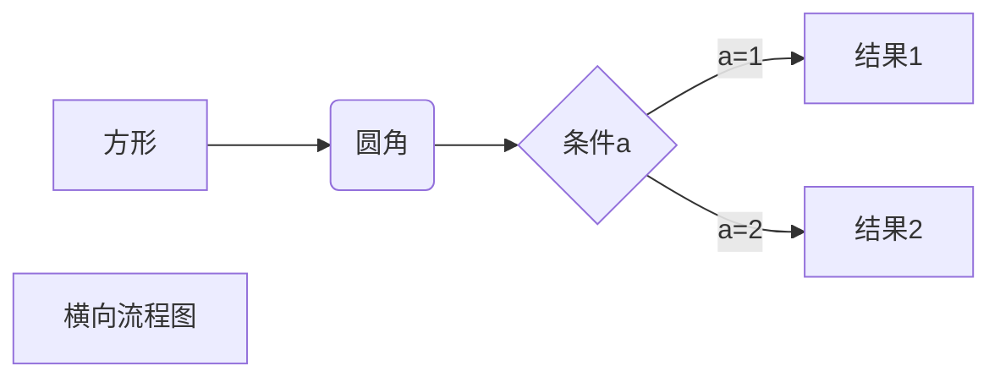

* content
{:toc}


## Hello World! 

不能可视化编辑有点残念啊qaq  
还要努力学习makedown啊[传送门](https://www.runoob.com/markdown/md-tutorial.html)  
  
  
使用 <kbd>Ctrl</kbd>+<kbd>Alt</kbd>+<kbd>Del</kbd> 访问黄网（大雾）  
**我好粗啊**

## 天皇认亲 NM$L

```sequence
Title: 标题：天皇认亲
对象A->对象B: 孙笑川你妈还好吗?（请求）
Note right of 对象B: 孙笑川对妈妈的描述
Note left of 对象A: 对象A的描述(提示)
对象B-->对象A: 我妈死了(响应)
对象B->小三: 我是你哥哥
小三-->>对象A: 你妈死了，我是孤儿好吧
对象A->对象B: 你真的是孤儿吗？
Note over 小三,对象B: 我们是兄弟
participant C
Note right of C: 没人看这个博客qaq我才是孤儿
```

好像没用…算了，以后再研究研究
