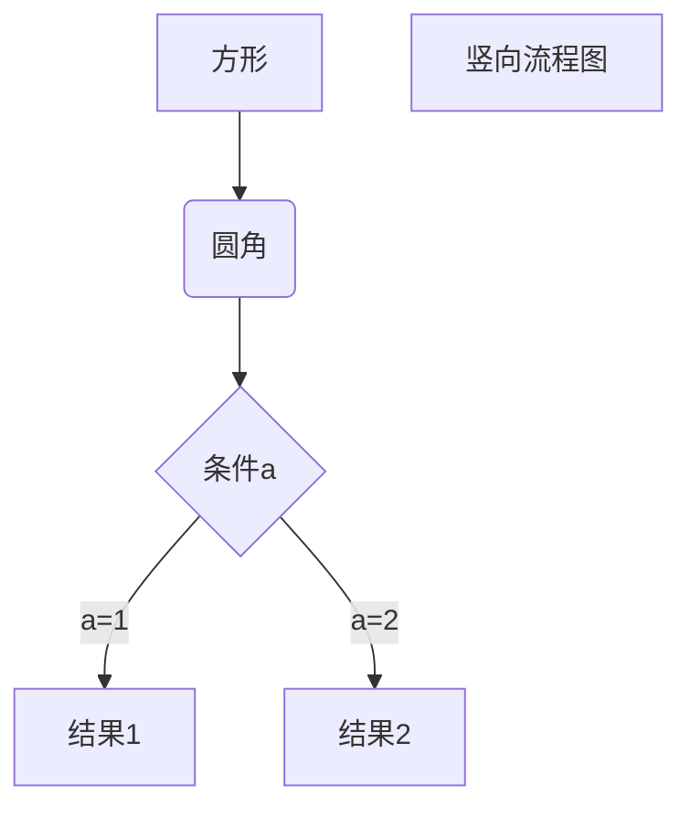

* content
{:toc}

## Hello World! 

不能可视化编辑有点残念啊
还要努力学习markdown啊[传送门](https://www.runoob.com/markdown/md-tutorial.html)

使用 <kbd>Ctrl</kbd>+<kbd>Alt</kbd>+<kbd>Del</kbd> 访问黄网（大雾

**我好粗啊**  

好像没用…算了，以后再研究研究  
## 测试公式  

$ \Gamma(z) = \int_0^\infty t^{z-1}e^{-t}dt\,. $
$$\Gamma(z) = \int_0^\infty t^{z-1}e^{-t}dt\,.$$

---

一个简单的数学公式,求圆的面积 $S=\pi r^2$   

---

$$
\mathbf{V}_1 \times \mathbf{V}_2 =  \begin{vmatrix} 
\mathbf{i} & \mathbf{j} & \mathbf{k} \\
\frac{\partial X}{\partial u} &  \frac{\partial Y}{\partial u} & 0 \\
\frac{\partial X}{\partial v} &  \frac{\partial Y}{\partial v} & 0 \\
\end{vmatrix}
${$tep1}{\style{visibility:hidden}{(x+1)(x+1)}}
$$

---

这是一个 mermaid 图层，使用的 `div` 标签包裹。  

    graph TD A[Client] --> B[Load Balancer] B --> C[Server1] B --> D[Server2]

这也是一个 mermaid 图层，使用的 `pre` 标签包裹。

<pre class="mermaid">
    graph TD A[Client] --> B[Load Balancer] B --> C[Server1] B --> D[Server2]
</pre>

这个使用的是 `<!-- htmlmin:ignore -->` 包裹，内部使用的是 `div` 标签。

<!-- htmlmin:ignore -->
<pre class="mermaid">
graph TD A[Client] --> B[Load Balancer] B --> C[Server1] B --> D[Server2]
</pre>
<!-- htmlmin:ignore -->

这个使用的是 `<!-- htmlmin:ignore -->` 包裹，内部使用的是 `pre` 标签。

<!-- htmlmin:ignore -->

graph TD A[Client] --> B[Load Balancer] B --> C[Server1] B --> D[Server2]

<!-- htmlmin:ignore -->

创建脚注格式类似这样 [^RUNOOB]。

[^RUNOOB]: 菜鸟教程 -- 学的不仅是技术，更是梦想！！！
